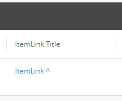

# Extended Sitecore Commerce Views
Custom Sitecore Commerce views plugin project with extended functionality for the Business Tools.

- [Supported Sitecore Experience Commerce Versions](#supported-sitecore-experience-commerce-versions)
- [Features](#features)
- [Installation Instructions](#installation-instructions)
- [Known Issues](#known-issues)
- [Disclaimer](#disclaimer)

## Supported Sitecore Experience Commerce Versions
- XC 9.2

## Features
- [Ui Hints, UI Types, and Icons Constants](#ui-hints-ui-types-and-icons-constants)
- [Custom Entity Links and Custom Item Links](#custom-entity-links-and-custom-item-links)
- [Target Attribute Support for Hyperlink Values](#target-attribute-support-for-hyperlink-values)
- [Automatic Page Redirect On Entity and Component Creation](#automatic-page-redirect-on-entity-and-component-creation)

### Ui Hints, UI Types, and Icons Constants
Remove the guessing game and human error by improving development efficiency with the comprehensive list of UI Hint, UI Type, and Icon names stored as constants.

**Enablement Policy Property:** N/A

To simplify usage, add the `using static` statement to the constants path.
```
using static Ajsuth.Foundation.Views.Engine.ViewsConstants.ViewProperty;
```


```
var viewProperty = new ViewProperty()
{
    Name = "RichTextField",
    UiType = UiTypes.RichText
};
```

_Sample Usage._

### Custom Entity Links and Custom Item Links
Custom entity and item links are more flexible than the standard entity and item links as they allow the configurations to be specified at the view property level with a fallback to the entity view values where values have not been specified. This allows entity views to contain multiple links under a single entity view that resolve to different routes.

ViewProperty extensions have been included to simply configuring the custom entity/item links.

**Dependencies:** https://github.com/ajsuth/Ajsuth.BizFx/tree/release/9.2/master

**Enablement Policy Property:** N/A

#### Custom Entity Link

The custom entity link will render _\<domain\>/entityView/Master/\<entity version\>/\<entity id\>_ 

e.g. _https://bizfx.local/entityView/Master/2/Entity-SellableItem-12345_

```
var customEntityLink = new ViewProperty
{
    Name = "Custom Entity Link",
    Value = "Custom Entity Link"
};
customEntityLink.SetCustomEntityLink(2, "Entity-SellableItem-12345");
entityView.Properties.Add(customEntityLink);
```

_Sample Custom Entity Link Usage._

#### Custom Item Link

The custom item link will render _\<domain\>/entityView/\<view name\>/\<entity version\>/\<entity id\>/\<item id\>_ 

e.g. _https://bizfx.local/entityView/MyView/3/Entity-SellableItem-12345/67890_

```
var customItemLink = new ViewProperty
{
    Name = "Custom Item Link",
    Value = "Custom Item Link"
};
customItemLink.SetCustomItemLink("MyView", 3, "Entity-SellableItem-12345", "67890");
// OR
// customItemLink.SetCustomItemLink("MyView", 3, "Entity-SellableItem-12345|67890");
entityView.Properties.Add(customItemLink);
```

_Sample Custom Item Link Usage._

### Target Attribute Support for Hyperlink Values
Links in BizFx may direct the user away from the current page, counter-intuitive to the flow of user navigation. Enabling the target attribute to be configured for links, specifically for opening links in a new window or tab via the '_blank' value, improves the UX of customisations to the Business Tools.

For the '_blank' target type, the link is opened in a new window or tab and is rendered with a '^' to signify that the link will be opened externally.

**Dependencies:** https://github.com/ajsuth/Ajsuth.BizFx/tree/release/9.2/master

**Enablement Policy Property:** N/A



_Sample 'Flat' entity view with various UI Types._

To configure a link, the view property should be configured with a new policy with PolicyId "Target" and single model with Name _\<target type\>_, e.g. "_blank". The plugin Ajsuth.Foundation.Views.Engine contains the view property extension method _SetTargetPolicy()_ and contains constants for available values to improve development.

```
// Default target value is '_blank'
entityLinkViewProperty.SetTargetPolicy();

// Specify the target type
itemLinkViewProperty.SetTargetPolicy(ViewsConstants.ViewProperty.Targets.Self);
```

### Automatic Page Redirect On Entity and Component Creation
When entities and components are created via BizFx, the user is automatically redirected to the entity view page for the newly create entity or component.

Supported Entities:
- Catalog
- Category
- Sellable Item
- Inventory Set
- Price Book
- Price Card
- Promotion Book
- Promotion

Supported Components:
- Price Snapshot

**Dependencies:** https://github.com/ajsuth/Ajsuth.BizFx/tree/release/9.2/master

**Enablement Policy Property:** RedirectOnCreate

## Enabling Features
In the environment configuration files, add the **ViewFeatureEnablementPolicy** and set the desired features to `true`. (See the **Enablement Policy Property** value under each feature). For example:
```javascript
{
	"$type": "Ajsuth.Foundation.Views.Engine.Policies.ViewFeatureEnablementPolicy, Ajsuth.Foundation.Views.Engine",
	"RedirectOnCreate": true
}
```

## Installation Instructions
1. Download the repository.
2. Add the **Ajsuth.Foundation.Views.Engine.csproj** to the _**Sitecore Commerce Engine**_ solution.
3. Add the **Ajsuth.Foundation.Views.Engine.csproj** as a reference to the desired projects.
4. Enable desired features, following [Enabling Features](#enabling-features).
5. Run the _**Sitecore Commerce Engine**_ from Visual Studio or deploy the solution and run from IIS.

## Known Issues
| Feature                 | Description | Issue |
| ----------------------- | ----------- | ----- |
|                         |             |       |

## Disclaimer
The code provided in this repository is sample code only. It is not intended for production usage and not endorsed by Sitecore.
Both Sitecore and the code author do not take responsibility for any issues caused as a result of using this code.
No guarantee or warranty is provided and code must be used at own risk.
